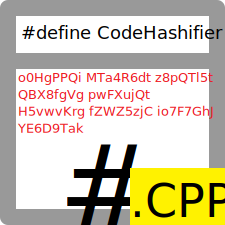

# CodeHashifier - C++ code obfuscator

Ever found some guy nagging you to send the code for a problem he never gave a second of thought? Or some bloke too lazy to finish the console application for his weekend assignment? This tool is for you.

CodeHashifier mangles your C++ code by using random `#define` hashes, concealing its idea from the readers while still maintaining its validity to compilers.

## Try it online

A live web version is available [here](https://trungnt2910.github.io/CodeHashifier).

## CodeHashifierWindowsForms

The subfolder `CodeHashifierWindowsForms` contains the original CodeHashifier project in 2020.

The original project uses a Mono C# frontend (built using `buildCodeHashifierUI.cmd`) and a C++ backend (built using the ancient [Dev-C++](https://sourceforge.net/projects/orwelldevcpp/) IDE). It also has a `CorruptedCodeHashifier` backend, used for trolling purposes only. The C++ backend can also be built as a command line tool that reads C++ code from `stdin` and outputs the hashified code to `stdout`.

This initial complex design allows code sharing between the UI and the CLI version, and serves as a `DllImport` practice exercise.

## License

CodeHashifier is licensed to you under the MIT license.